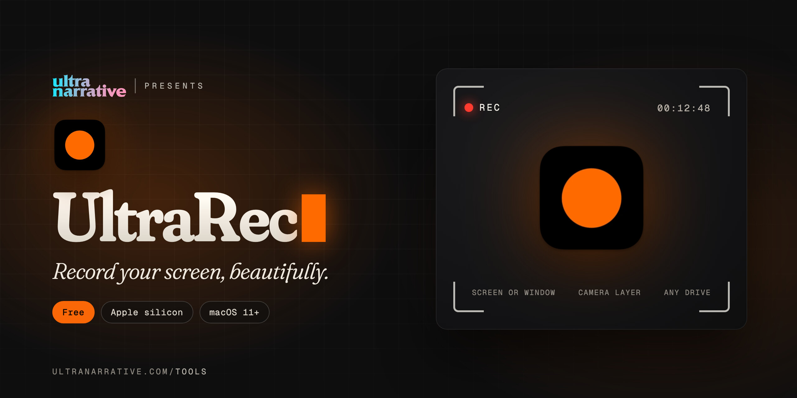

  

# UltraRec

**Record your screen, beautifully.**

*Dan Rodriguez · [UltraNarrative](https://www.ultranarrative.com) · [ultranarrative.com/tools](https://www.ultranarrative.com/tools) · [dan@ultranarrative.com](mailto:dan@ultranarrative.com) · October 2026*

---

Record a whole screen or a single window, with your camera as a layer, straight to any drive. If something crashes, your recording is recovered.

Free, for a Mac with Apple silicon, macOS 11 or later. This repository holds the installer only. More free apps at [ultranarrative.com/tools](https://www.ultranarrative.com/tools).

## Download

[UltraRec-mac-arm64.dmg](https://github.com/ultranarrative/ultrarec-releases/releases/latest/download/UltraRec-mac-arm64.dmg)

This link always points to the newest version.

## Opening it the first time

I sign UltraRec myself rather than through Apple, so macOS asks once. Open the disk image, drag UltraRec to Applications and open it. When macOS stops it, go to System Settings, then Privacy & Security, and click Open Anyway.

## Support

UltraRec is free, with no account and no subscription. If it helps you, [buy me a coffee](https://ko-fi.com/danrsuarez).

Made by Dan Rodriguez at [UltraNarrative](https://ultranarrative.com). © 2026 UltraNarrative. All rights reserved.
